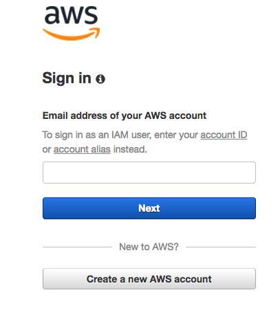
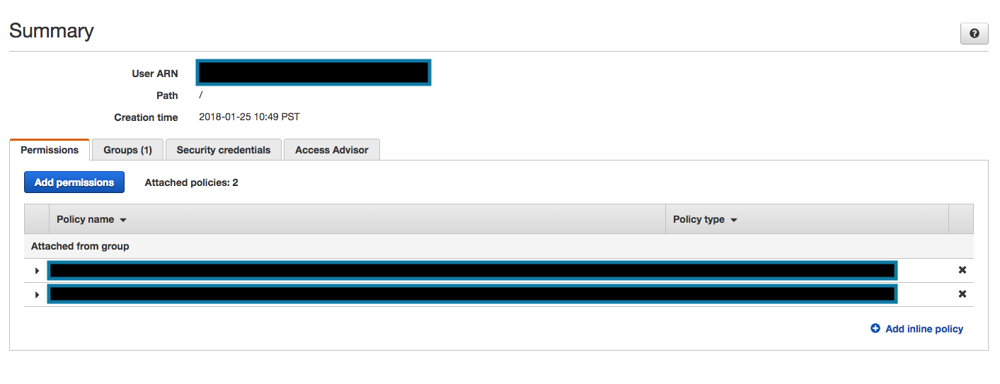
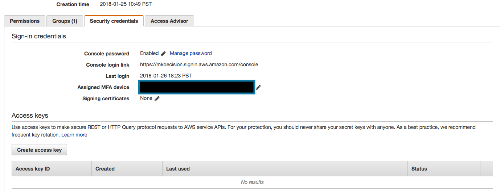

# Setting Up Your Credentials

### By Eric Hendrickson

This tutorial will teach you how to set up your AWS CLI keys in order to upload your Lambda functions within the repository. If you follow these instructions, you should in theory be able to upload to the TFE Workspace so long as you use `pnpm run package` and `pnpm run deploy`. Right now, this implementation will only work if you’re on a \*NIX system (OS X, Unix, or Linux) or if you’ve managed to get Bash to work on Windows.

First, you must log into AWS with your MK Decision account. Assuming you signed in with your own account, log out, and when you’re given the option to log in again, look for the link that says "Sign in to a different account." It should look like this:

Type in "mkdecision". When you hit "Next," you’ll be brought to a new login page where you can sign in using your MK Decision username and password. Once you’re logged in, go to IAM. On the left side of the page, click on "Users". Then select your username. You will be brought to this page:

Click on the "Security Credentials" tab. You will see this.

You need to click "Create access key" (note: if you are unable to do so, that probably means that you haven’t enabled multi factor authentication, so get that done and then try this again). You will see a pop up with a column that says "Access key ID" and another that says "Secret access key," which will be masked unless you click "Show" next to it.

Do not close the window, but type in your console `aws configure --profile mkdecision`. You will be asked to input your Access Key ID, Secret access key, default region, and default output format. You should input your data as follows:

	$ aws configure --profile mkdecision
	AWS Access Key ID [None]: [paste the access key ID you just created]
	AWS Secret Access Key [None]: [paste the secret access key that you also got]
	Default region name [None]: us-west-2
	Default output format [None]: json

Now, this is important: you cannot get your key again after you close the popup window. This means that if you delete or lose your secret key, you’ll need to generate a new AWS Access Key ID and start over with configuring your profiles.

When you’ve finished that, you will need to switch your role to the TFE workspace. If you haven’t done this yet, ask the AWS administrator to send you a link to do this and make your name for the role "TFE Workspace". Go to IAM within TFE Workspace. You will no doubt notice that there are a lot less permissions now. Go to the Roles tab. You will see these roles:

Click on the role that says TFE. You will see this page.

Look at the row that says "Role ARN". Copy this role. Then run `vim ~/.aws/config` or `nano ~/.aws/config` to update your profiles. Append this to the end of the file:

    [profile TFEWorkspace]
    role_arn = [the ARN from earlier]
    source_profile = mkdecision
    region = us-west-2
    output = json

Notice that this profile inherits from the mkdecision profile and that the ARN is your TFE role’s ARN. Keep in mind that you generally should not be touching this file. Use `aws configure --profile [somename]` to create roles. However, in this case, you need to update the file because without the role you won’t be able to run `pnpm run package` and `pnpm run deploy`. Note also that you MUST have a default region and unless otherwise specified that will be us-west-2.

At this point, if you have the repository, you should be able to run `pnpm run package` and `pnpm run deploy`. When you run either of these commands, a bash script is called that checks if the CloudFormation stack name and the profile name are present in files in the repository directory called `.stackname` and `.profilename` respectively. If they’re not, then it will ask you to input whichever of these values are missing, like so:

    Please enter your AWS stack name:
    eric
    Please enter your AWS profile name:
    TFEWorkspace

Remember to correctly put in the profile name that you just created, otherwise neither `pnpm run package` nor `pnpm run deploy` will work. However, the stack name is up to you. We suggest you just use your first name. After running `pnpm run package` you should run `pnpm run deploy`. Provided you have done everything correctly, at least `pnpm run package` should run successfully. If you have errors when running `pnpm run deploy`, talk to a developer with experience with AWS CloudFormation.

One last thing: NEVER update `.stackname` or `.profilename` in your IDE. Oftentimes this will add a newline automatically to the file, which will cause an error. If you need to change either of these files, you should delete the file and just input the values the next time you run `pnpm run package` or `pnpm run deploy`.
