# Hooking up a Lambda Function to API Gateway

## Overview

You have now successfully created a Lambda function. Now what? How do I hook it up so users can access it, say, on a web page?

The answer lies within API Gateway. API Gateway allows a user to access AWS services via HTTP requests. In our case, we are going to use API Gateway to trigger the Lambda function from the previous chapter.

## Tutorial

First start by navigating to API Gateway. You should see this page:

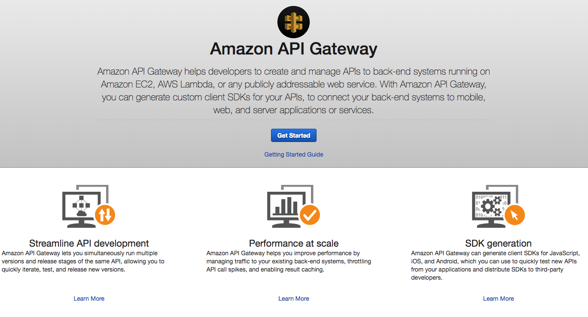

Click "Get Started". Ignore the PetStore Example API, and click "New API". Call it "helloworld"

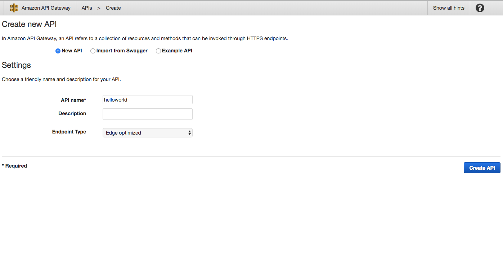

Click "Create API". You'll be brought to this page:

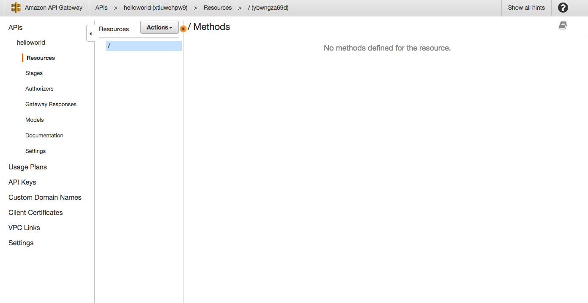

As you can see, you already have an API, although now it only has a root endpoint. You will notice that you are in a section called Resources. Click on the "Actions" dropdown menu, and you'll see this:

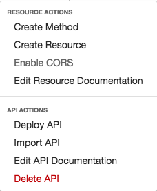

"Create Method" is pretty self explanatory. It allows you to select an HTTP method for a resource. You could even assign a method to the root endpoint, although for this tutorial we are going to create our own resource. Click on "Create Resource".


Next to "Resource Name," type in "hello-world". You will notice that "Resource Path" is also being set as "hello-world". You can change the name if you like. Click "Create Resource". Our API now looks like this:

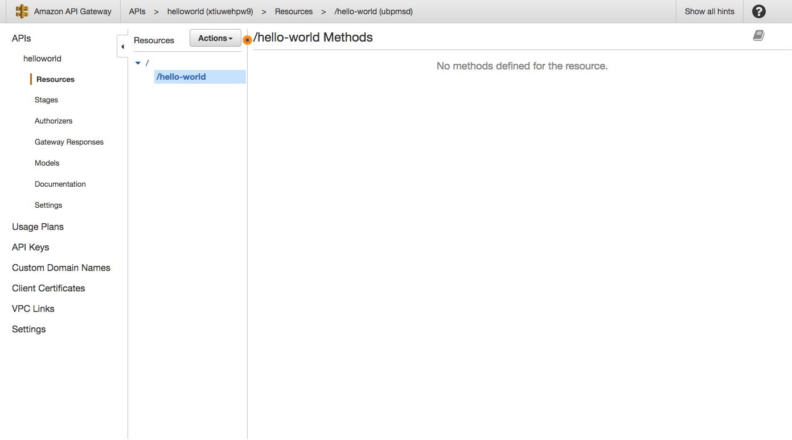

While "/hello-world" is highlighted, click "Actions" again and select "Create Method". A blank dropdown will appear under the resource. Click it and select "GET".

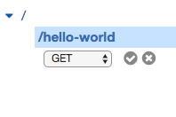

Click the check mark next to the dropdown and the method will be created. You'll be taken to this page.

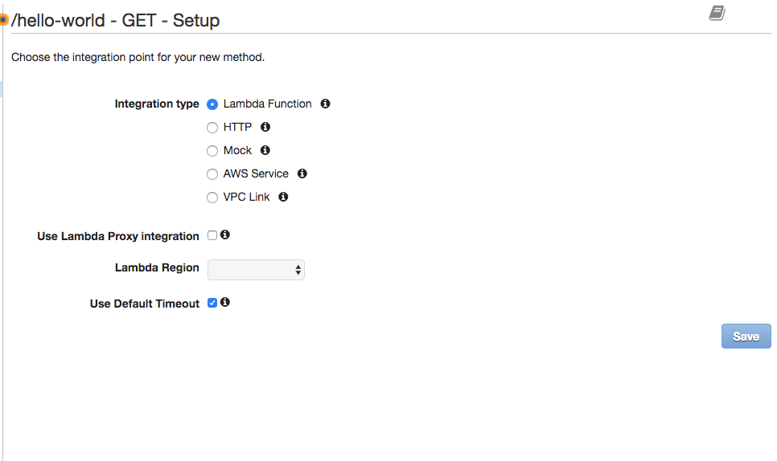

You'll notice that the "Integration Type" is already set to "Lambda function". This is what we want. You'll see a dropdown next to "Lambda Region". Select the region your Lambda function is in, and then you'll see an input called "Lambda Function". Type in "helloWorld".

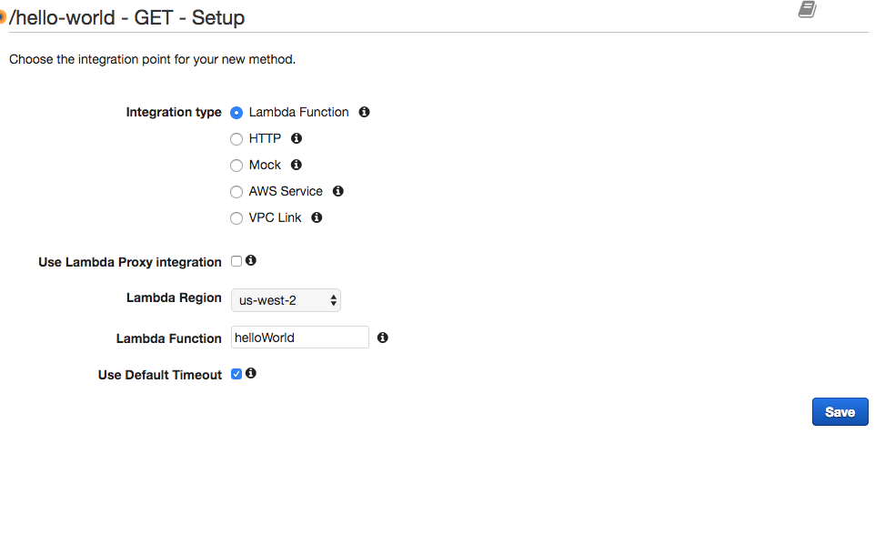

Click "Save". A pop up dialog will notify you that you are giving API Gateway permission to trigger this Lambda function. Click "Okay". You'll be directed to this page:


A quick breakdown of what's going on is that API Gateway sets up the resource and allows a user to make an HTTP request:

1. "Method Request" configures how you're going to access the endpoint (such as authorization)
2. "Integration Request" handles how an API call works related to other AWS services. In this case, we are integrating with a particular Lambda function.
3. "Integration Response" in similar fashion handles what is returned from the AWS service and configures an HTTP response. In our case, it sets the method response status to 200 (successful). Depending on how we configure AWS Lambda this may not be necessary.
4. "Method Response" then returns the HTTP response. Our API returns a response that includes what is called back in our "helloWorld" Lambda function ("Hello from Lambda") along with the 200 status.

In the "Client" box to the left, click "TEST". You'll be directed to a method test.

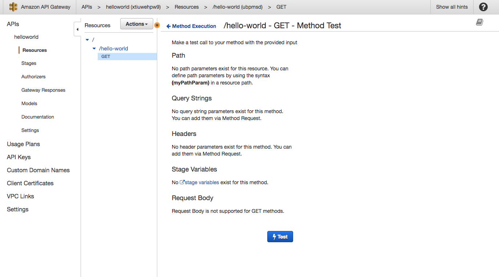

Click the "Test" button and you'll get this output:


This proves that we have the HTTP response that we want. Note that if you callback an error in your Lambda function you will get a response with a 500 status code (but since we're only calling back a string this is what we're going to get).

Click "Actions" again and click "Deploy API". You'll see this pop up dialog:

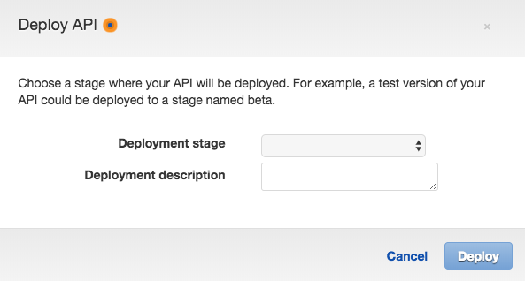

In the Deployment Stage dropdown, select "[New Stage]". Name it "dev" (we will name it different things based on where we are in the development cycle, but when you are in the initial development phase always name it "dev").

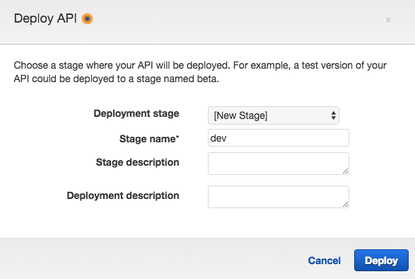

Click "Deploy". You'll be brought to this:

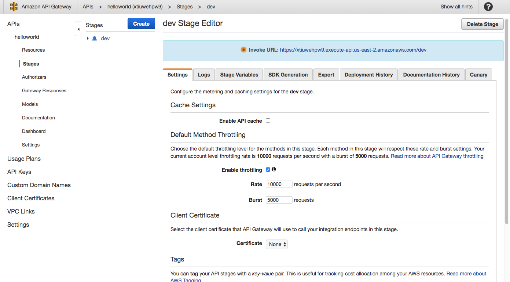

Don't worry about configuring the stage right now. To call the endpoint you made and configured in your API, click on the arrow to the left of "dev". You'll see this tree.

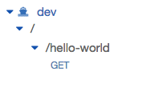

Click on "GET" below "/hello-world". You'll be brought to this:

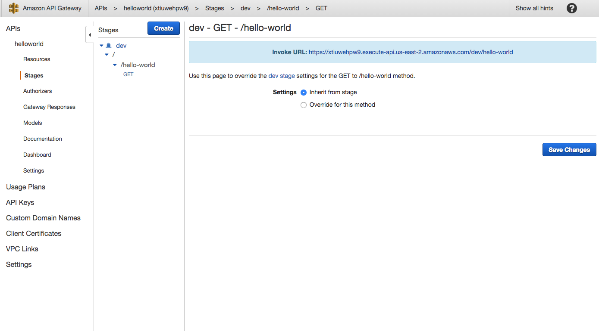

If you copy and paste that link in a browser, you will see the string `"Hello from Lambda"` displayed. You have successfully completed your very first API using Lambda and API Gateway!

Note that if you're making endpoints that utilize other methods (e.g., PUT, POST, DELETE) you will certainly require a tool such as [Postman](https://www.getpostman.com/) or [cURL](https://en.wikipedia.org/wiki/CURL) to do so, but in this case just using a browser is fine.

## How to Develop Lambda Functions that Interact with API Gateway

When developing Lambda functions that API Gateway calls, it is important to think about what you're using in your callback. In general, it's best to not call back a string like in the Lambda function used in the example above (`callback(null, 'Hello from Lambda');`). Instead, you should callback a JSON response object, such as this:

```javascript
const response = {
  statusCode: 200,
  body: JSON.stringify({
    data: 'Hello from Lambda'
  })
};
callback(null, response);
```

Depending on whether or not this is a successful case, you can put in other status codes. [Refer to this page](https://en.wikipedia.org/wiki/List_of_HTTP_status_codes) to find a status code that is appropriate for your needs.

## CloudWatch Logs

As you get further into development, there may be times where you can no longer check the Lambda console or the API gateway testing environment to view your results. This might be because you are calling a backend function through the UI to see if it is working as intended with the added layer of complexity. In these situations, you will need a way to check the Lambda function's console logs, or more importantly, their error messages.

CloudWatch is another AWS resource that we can utilize in scenarios like this one. CloudWatch keeps a record of all the events from start to finish that a Lambda function goes through when it is called. Here you can see any console logs or errors thrown by the function to determine the status of the function you are trying to test.

In the example above, we created a simple "Hello, World!" Lambda function and hooked it up to API Gateway. Now let us locate the phrase "Hello from Lambda" in the CloudWatch logs.

If you navigate to the CloudWatch console in AWS, you will see a menu on the left hand side. If you click on the "Logs" section, you will see a list of log groups which are essentially all of the Lambda functions that have had activity in whichever AWS region you are currently logged into. Locate the log group for the helloWorld Lambda function in that list.


After clicking on the helloWorld log group, you will see a list of log streams. Each one of these streams is one iteration of the helloWorld function. Each stream logs all events for all of the times the function has been called. A new stream is created every time the Lambda function gets updated. Below you can see this function is on its fourth iteration. The iterations are logged from most recent to least recent by default.

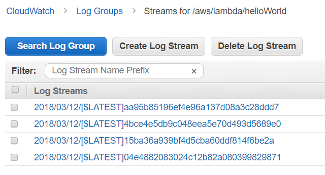

So far, if you were to test your function through API gateway, the Lambda console, or Postman, you would only see one stream. That stream would be almost empty. If you clicked on the stream you would see that it only contains START, END, and REPORT logs.


That is because we do not have any `console.log`s in our code just yet. Right now, the function is running and resolving but not showing any output in our logs. In the Lambda function, we can add a line of code above the `callback` function. Let's make it simple for now:

```javascript
console.log(response);
```

If we now test the function and check our logs, we will see a second log stream that gives us more information inside. Here we can see the entire object that is getting called back. It contains the status code and the body containing the data "Hello from Lambda."


Now, let's try to get the words "Hello from Lambda" by themselves. To do this, we will have to drill down into the object and extract the data from the body. If your first thought was to change the `console.log` to:

```javascript
console.log(response.body.data);
```

you would be close, but incorrect. This would return an `undefined` value. This is because the data key was stringified using `JSON.stringify()` above. This is the cause of undefined responses fairly often while fixing bugs, so be aware of where you are stringifying data and where you are parsing data. We could `JSON.parse()` the data key to fix this error, but lets just take the `JSON.stringify()` out for now as to not over complicate things. Now when you test your function again, you will end up with a log that is just the words "Hello from Lambda" in your CloudWatch logs.

 

## Conclusion

Hopefully by now you have some grasp at how to use API Gateway to trigger Lambda functions. Lambda functions can be used to read from and write to databases, send text messages or email, and many, many other things. The following tutorials will mostly focus on Lambda functions with the assumption that you can later on trigger these functions with API Gateway.
